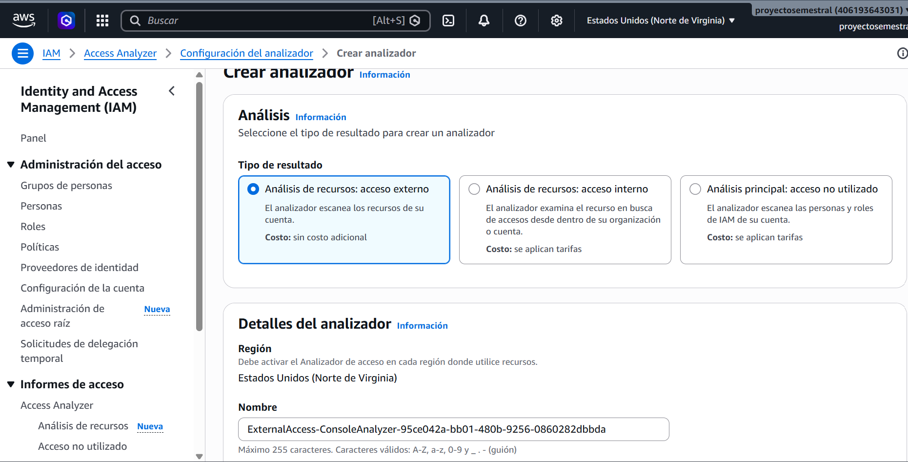
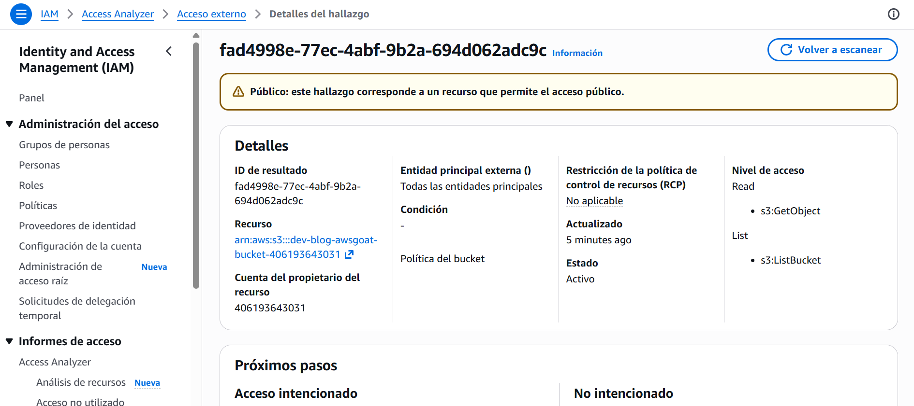
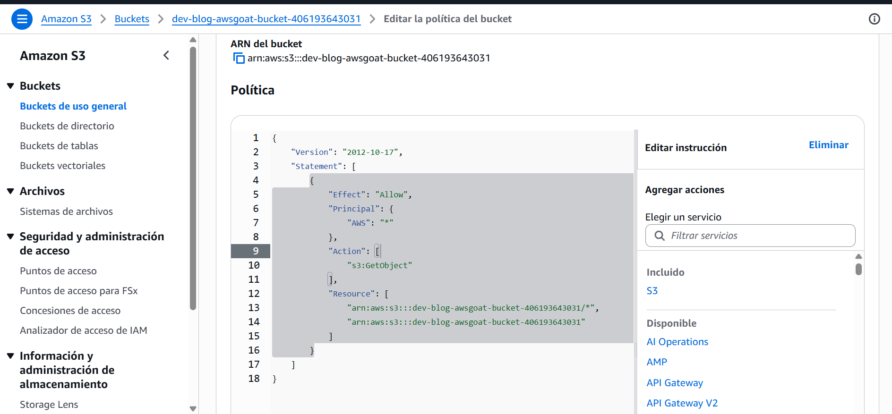
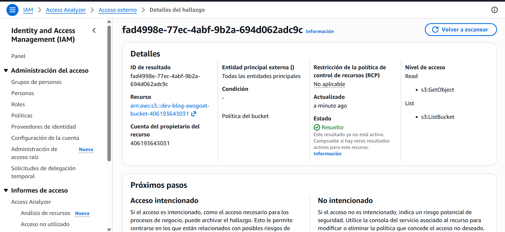
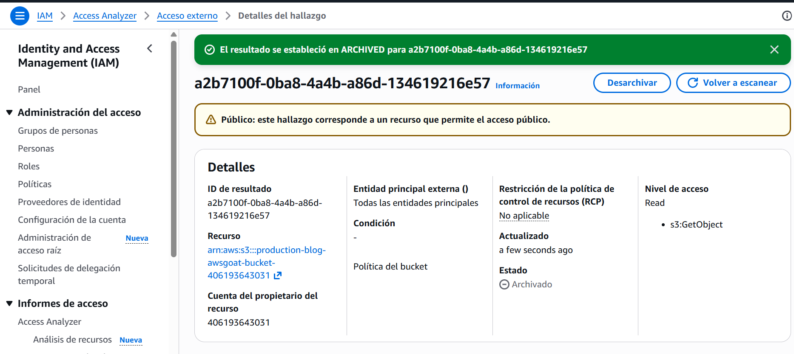
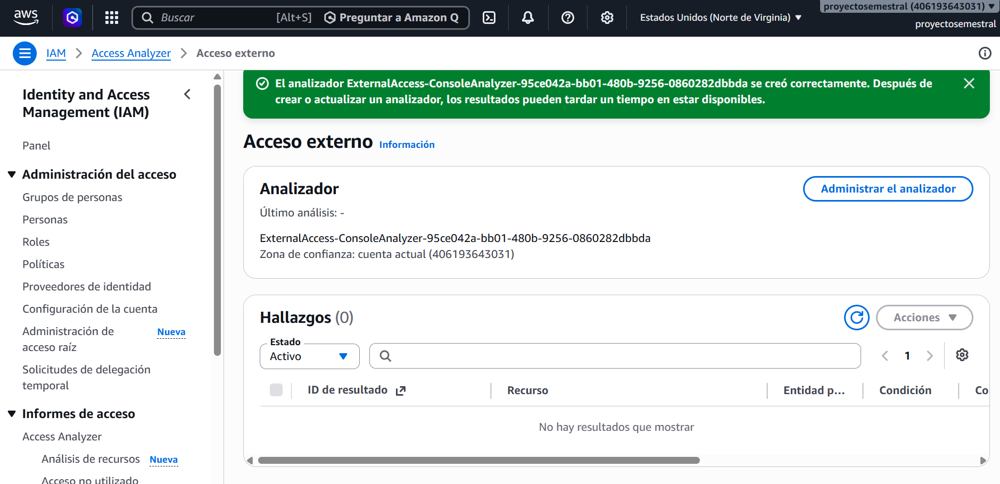

# Control defensivo: AWS IAM Access Analyzer

Tipo de resultado

Este tipo de resultado es el cual escanea los recursos de la cuenta en busca de accesos otorgados a entidades externas.

Detecccion de hallazgos

Tenemoss 3 hallazgos activos, detectando acceso externo en los buckets S3 dev-blog-awsgoat-bucket y production-blog-awsgoat-bucket (dos hallazgos en el bucket dev y uno en el de producción), confirmando que ambos buckets son accesibles desde fuera de la cuenta.

Edicion de politica

Se accedió a la política del bucket dev-blog-awsgoat-bucket-[ACCOUNT_ID_REDACTED] desde la sección de seguridad y administración de acceso de Amazon S3, mostrando el editor de política del bucket con la declaración configurada, incluyendo el principal, la acción "s3:GetObject" y los recursos asociados al bucket.

Una vez editamos la politica, deberemos esperar unos minutos hasta que salga en estado resuelto

Verificacion de permisos

IAM Access Analyzer confirma que el recurso "permite el acceso público" (Público), con nivel de acceso "Read" (s3:GetObject) y entidad principal "Todas las entidades principales". Tras aplicar la corrección correspondiente, el hallazgo cambió su estado a "ARCHIVED" (archivado), indicando que el acceso público de este recurso ya fue remediado.

Verificacion tras correccion

Ya no muestra hallazgos activos (0 hallazgos), confirmando que el acceso externo detectado previamente en los buckets dev-blog-awsgoat-bucket y production-blog-awsgoat-bucket fue exitosamente remediado.
