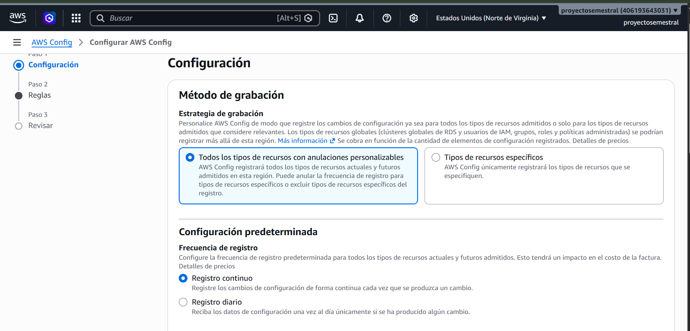
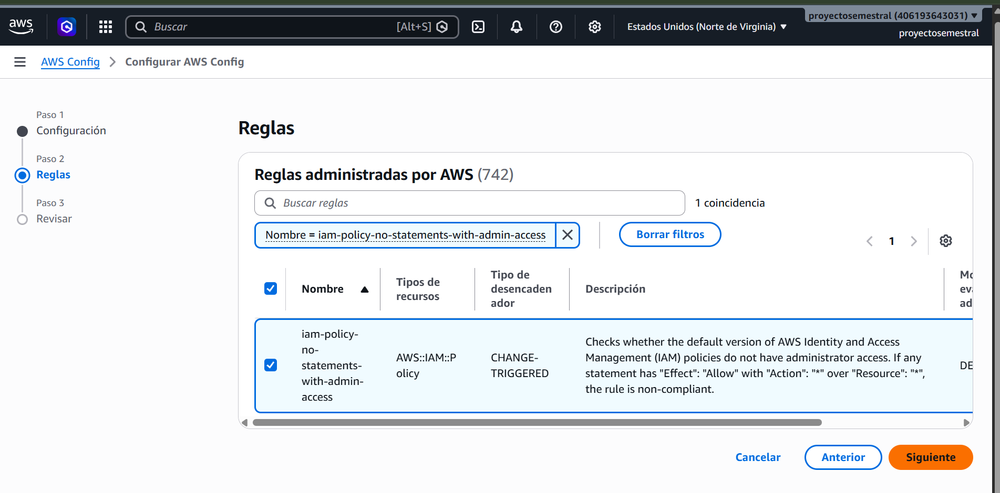
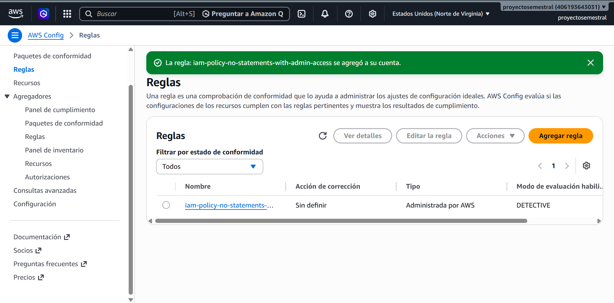

# Control defensivo: AWS Config

Metodo de grabacion

Definimos el método de grabación del servicio. Se seleccionó la estrategia "Todos los tipos de recursos con anulaciones personalizables", la cual permite que AWS Config registre todos los tipos de recursos actuales y futuros admitidos en la región, incluyendo la posibilidad de anular la frecuencia de registro o excluir tipos de recursos específicos.

Reglas administradas por AWS

Esta regla, de tipo "CHANGE-TRIGGERED", verifica que la versión predeterminada de las políticas de AWS Identity and Access Management (IAM) no otorgue acceso de administrador; es decir, evalúa como no conforme cualquier política que contenga una declaración

Creacion de regla

Una vez ya hayamos creado, ya habremos completado este paso, lo que se busca con esta regla es detectar la creación de políticas IAM excesivamente permisivas
