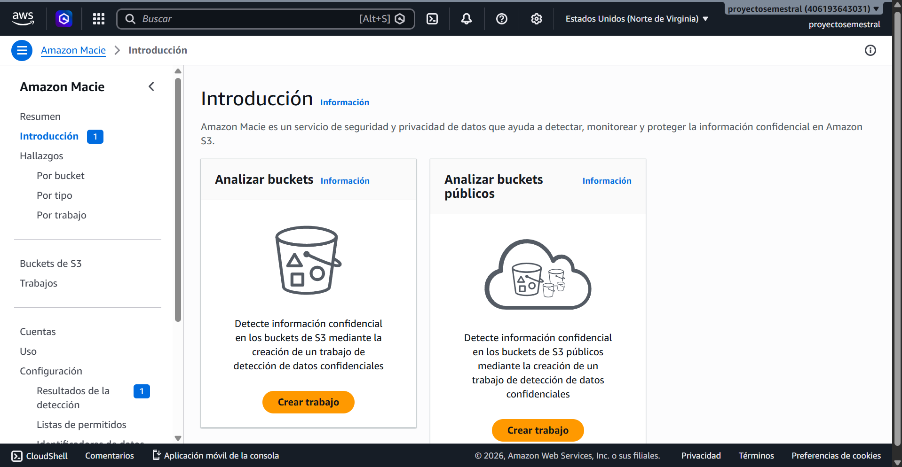
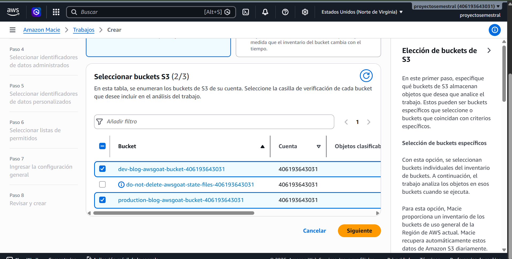
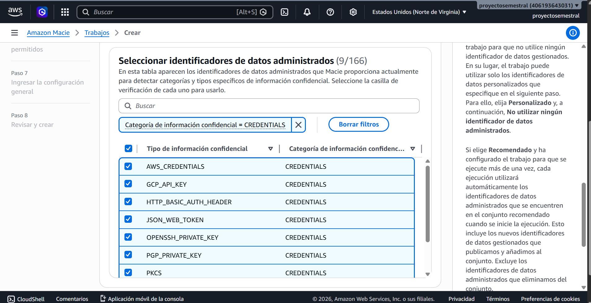
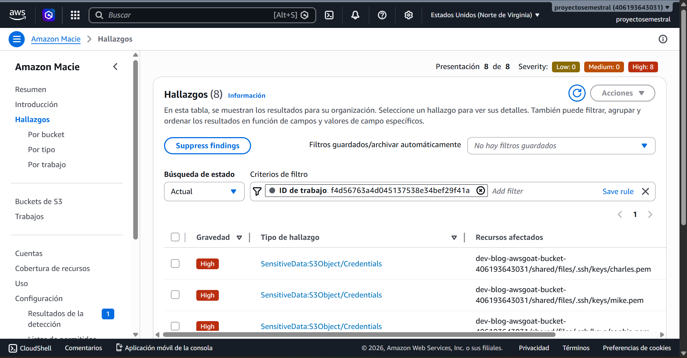
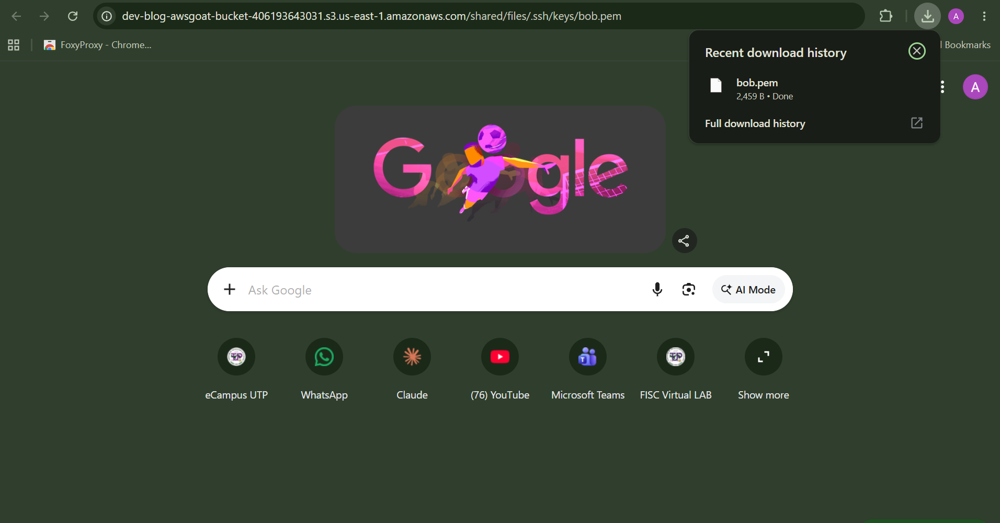
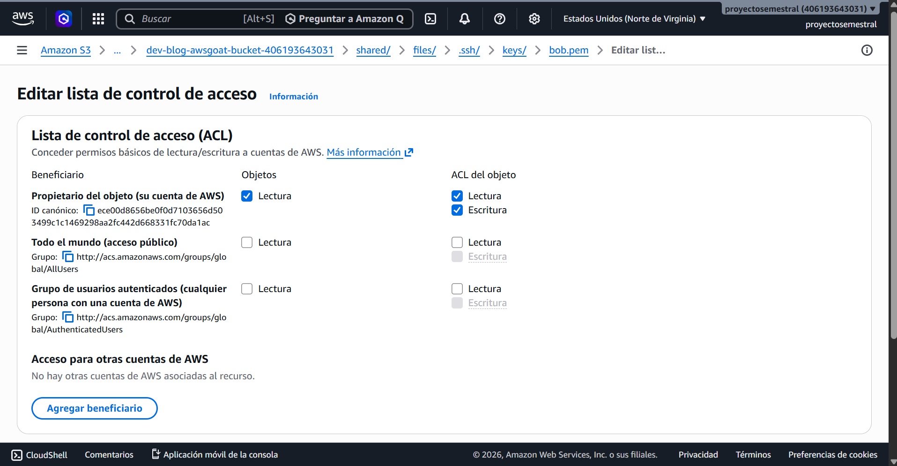
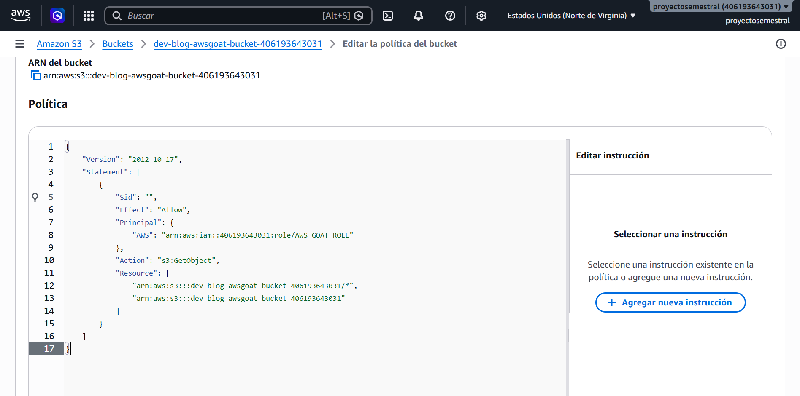
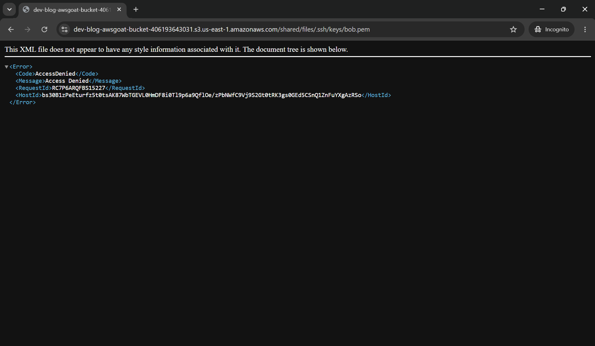

# Control defensivo: Amazon Macie

Crear trabajo en Analizar depósitos públicos

Creamos un amazon macie que detecta información confidencial en los buckets de S3 mediante un trabajo de detección de datos.

Seleccionar buckets

seleccionamos manualmente los buckets dev-blog-awsgoat-bucket-[ACCOUNT_ID_REDACTED] y production-blog-awsgoat-bucket-[ACCOUNT_ID_REDACTED] para su análisis, excluyendo el bucket do-not-delete-awsgoat-state-files

Seleccion de identificadores

Seleccionamos todas las informaciones confidenciales con categoria credencial con el fin de que el trabajo detecte específicamente credenciales y claves privadas expuestas en los buckets seleccionados.

Ver que objetos son vulnerables

En hallazgos podemos ver que hay 8 activos, donde si seleccionamos uno cualquiera, nos va a arrojar toda su informacion

Correcion de permisos mal configurados

los objetos vulnerables se encuentran en el bucket dev. Por lo tanto, sustituyamos production por dev y añadamos la carga útil después de la URL. Veamos si podemos acceder al archivo .pem.

el archivo bob.pem se ha descargado. Esto significa que cualquier persona en internet puede acceder a él y obtener acceso a la instancia EC2.

Eliminar acceso de lectura publico

Para intentar remediar la descarga automatica, eliminamos le lectura que estaba publica

Declaracion de politica

Editamos la politica en la parte del sid, porque tenia un asterisco, lo que queria decir que cualquiera podia entrar y hacer la descarga

Entrar nuevamente a la URL para descargar el bob.pem

Ya no nos deja descargar el pem, lo que quiere decir, que nuestra remediacion surtio efecto
