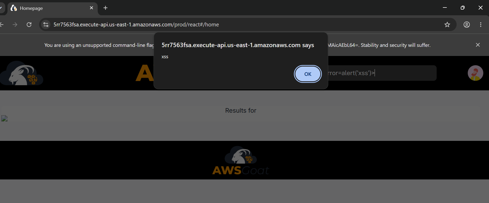

# Reto 1: Cross-Site Scripting (XSS)

Realizamos un ataque de Cross-Site Scripting (XSS) sobre la barra de búsqueda de la página principal del blog de AWSGoat. Primero probamos el payload estándar de alerta con la etiqueta script, el cual no se ejecutó debido a restricciones del navegador sobre ese tipo de etiquetas insertadas dinámicamente. Posteriormente probamos un payload alternativo utilizando una etiqueta de imagen con un evento onerror, apuntando a una fuente inexistente para forzar el error y disparar la ejecución del script.

Lo que encontramos:

| Campo | Detalle |
|---|---|
| Vulnerabilidad | Reflected XSS (Cross-Site Scripting) — DOM-based |
| Clasificación OWASP | A03:2021 – Injection |
| Ubicación | Barra de búsqueda del blog (Homepage) |
| Payload usado |  |
| Impacto | Ejecución de JavaScript arbitrario en el navegador de la víctima; podría usarse para robar cookies/tokens de sesión, redirigir usuarios, o realizar acciones en su nombre |
| Evidencia | Popup de alerta confirmado en el navegador |
