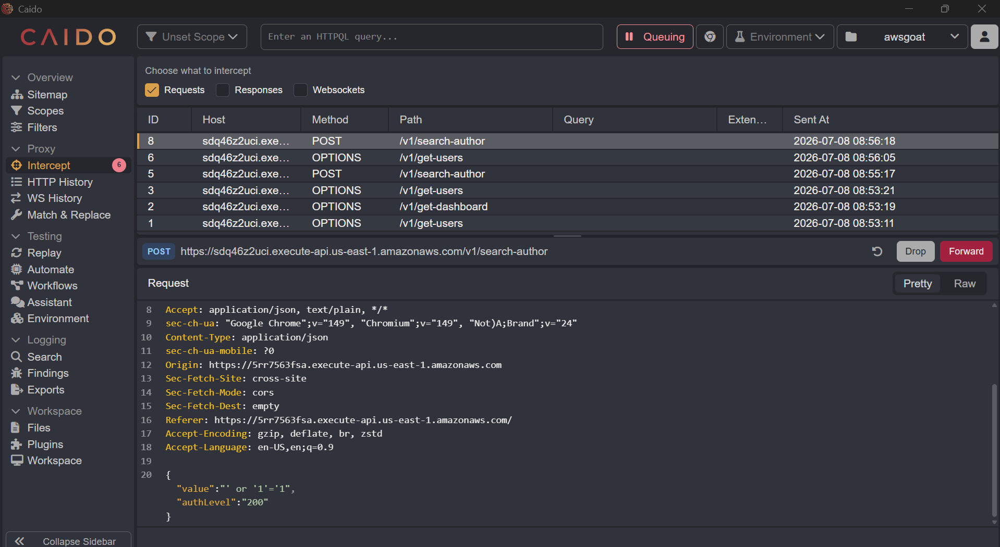
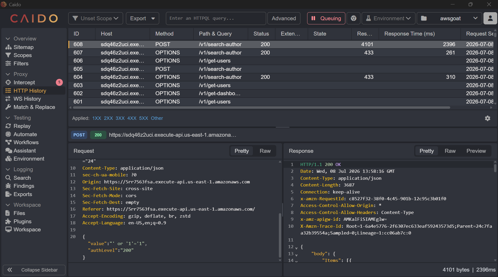
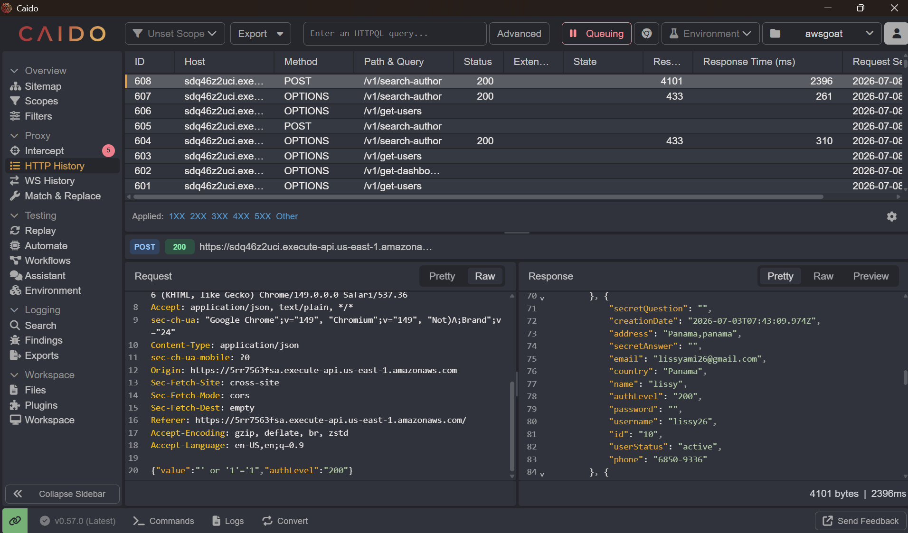

# Reto 2: SQL Injection

Captura de petición

Activamos el modo de intercepción en Caido para pausar y capturar la petición generada al realizar una búsqueda en la pestaña de usuarios. Modificamos el valor del parámetro de búsqueda, inyectando la condición ' or '1'='1' junto con el parámetro authLevel, y reenviamos la petición desde la pestaña Intercept para observar el comportamiento de la aplicación ante esta inyección SQL.

Enviar hacia HTTP History

Al reenviar la petición modificada mediante el botón Forward, esta se registra automáticamente en la pestaña HTTP History, donde pudimos visualizar la respuesta completa del servidor. Obtuvimos un código de estado 200 OK junto con un cuerpo de respuesta de mayor tamaño (4101 bytes) que contenía múltiples registros dentro de un arreglo, evidenciando que la inyección SQL permitió extraer información de varios usuarios en lugar de un único resultado esperado.

Vista de información sensible

Finalmente, al inspeccionar el cuerpo completo de la respuesta pudimos visualizar la lista detallada de todos los usuarios registrados en la aplicación, incluyendo información sensible como nombre, correo electrónico, país, dirección, teléfono, nombre de usuario, nivel de autenticación y contraseña. Esto confirmó que la vulnerabilidad de SQL Injection permitió acceder a datos personales de todos los usuarios del sistema sin autorización, evidenciando una falla crítica en la validación de las consultas realizadas hacia la base de datos.

Lo que encontramos:

| Campo | Detalle |
|---|---|
| Vulnerabilidad | SQL Injection |
| Clasificación OWASP | A03:2021 – Injection |
| Ubicación | Endpoint /v1/search-author (buscador de usuarios en la pestaña "User") |
| Payload usado | ' or '1'='1 |
| Impacto | Fuga masiva de datos personales de todos los usuarios registrados (nombre, email, teléfono, dirección, username, authLevel, pregunta secreta, contraseña); posible bypass de autenticación |
| Evidencia | Captura de la petición con el payload inyectado y de la respuesta mostrando los datos de múltiples usuarios |
