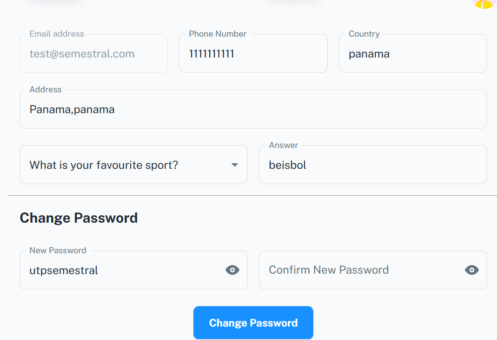
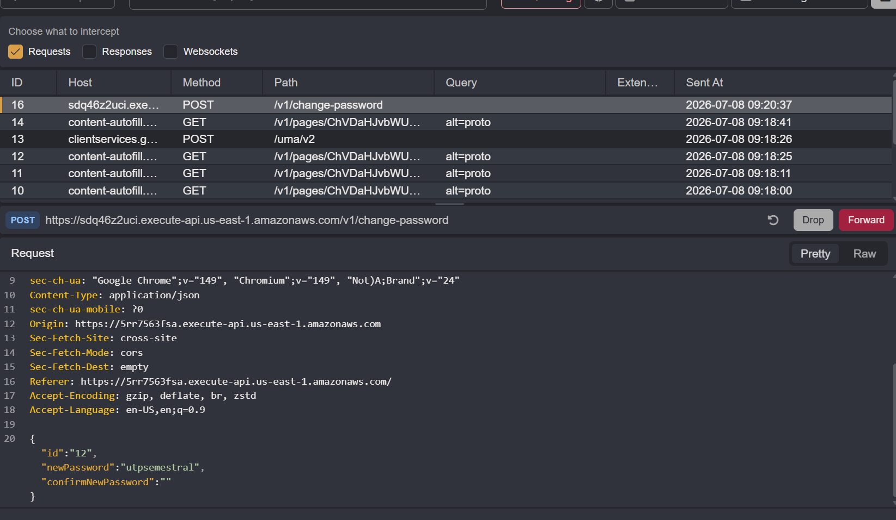
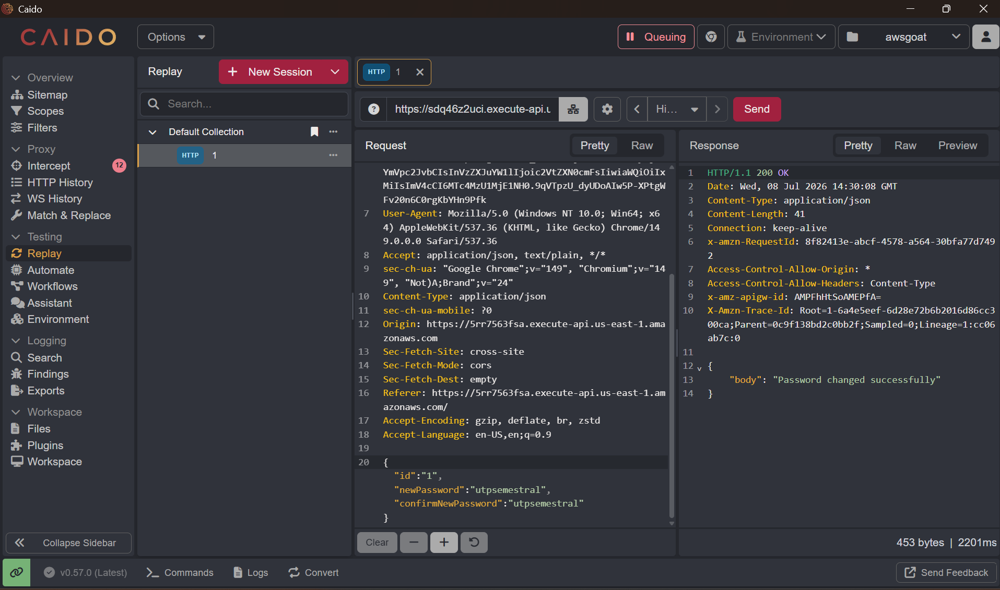

# Reto 3: Insecure Direct Object Reference (IDOR)

Cambio de contraseña

Ingresamos al perfil de nuestro propio usuario dentro de la aplicación y realizamos el cambio de contraseña utilizando el formulario disponible, estableciendo una nueva contraseña de prueba (“utpsemestral”).

Captura de petición

Activamos el modo de intercepción en Caido y capturamos la petición POST generada al enviar el formulario de cambio de contraseña, dirigida al endpoint /v1/change-password. En el cuerpo de la petición pudimos identificar los parámetros id, newPassword y confirmNewPassword, confirmando que el identificador del usuario se envía directamente en la petición, lo cual representa un punto de entrada potencial para manipular dicho valor y acceder a datos de otros usuarios.

Cambio de valor y ver respuesta

Al reenviar la petición, obtuvimos una respuesta con código 200 OK y el mensaje "Password changed successfully", confirmando que logramos modificar la contraseña de una cuenta ajena sin contar con los permisos correspondientes, evidenciando así la vulnerabilidad de Insecure Direct Object Reference (IDOR).

Lo que encontramos:

| Campo | Detalle |
|---|---|
| Vulnerabilidad | Insecure Direct Object Reference (IDOR) |
| Clasificación OWASP | A01:2021 – Broken Access Control |
| Ubicación | Endpoint de cambio de contraseña (perfil de usuario) |
| Payload usado | {"id":"1", "newPassword":"utpsemestral", "confirmNewPassword":"utpsemestral"} (modificando el id propio, que era 12, por el id de otro usuario) |
| Impacto | Cambio no autorizado de la contraseña de otro usuario sin su consentimiento; posible toma de control total de cualquier cuenta del sistema solo conociendo o iterando su ID |
| Evidencia | Captura de la petición con el id modificado y de la respuesta confirmando "Password changed successfully" |
