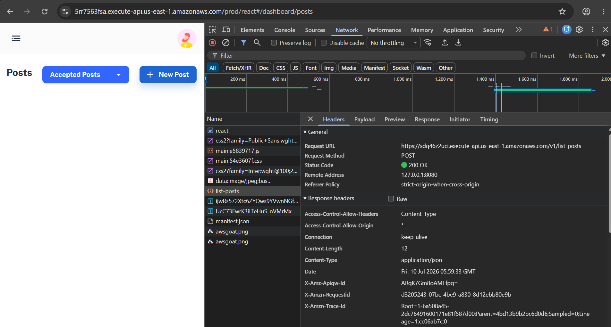
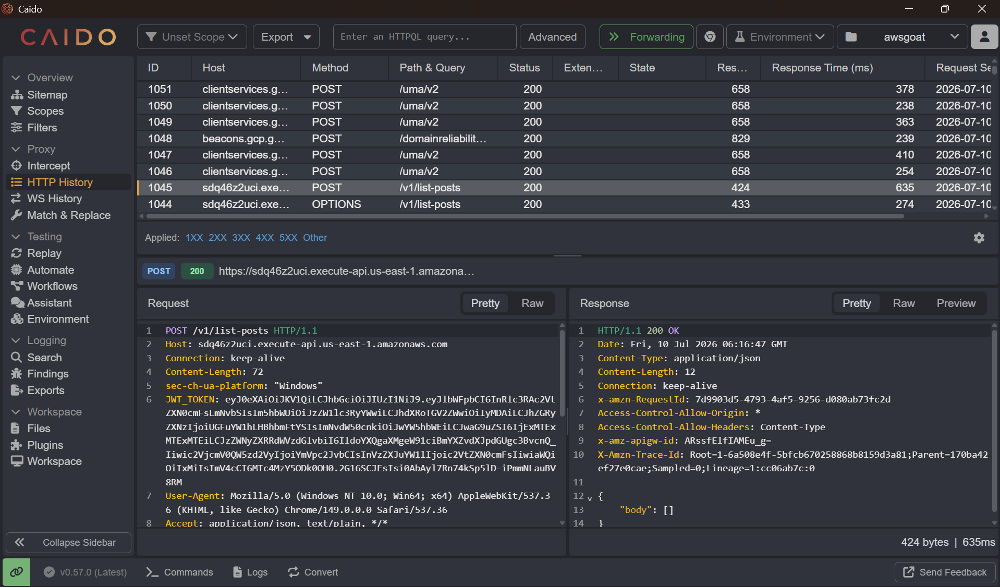
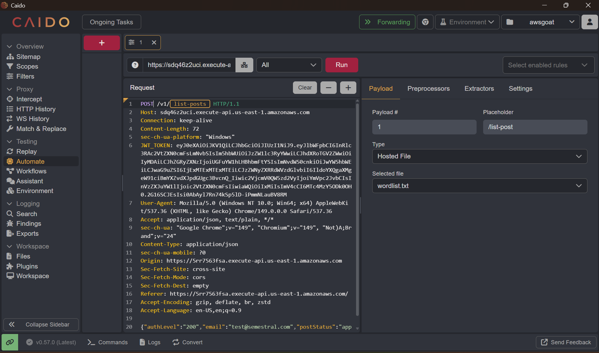
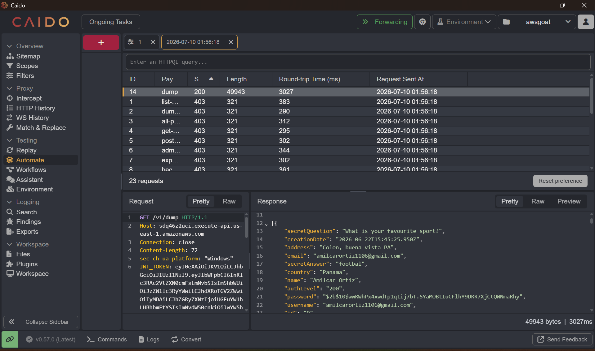

# Reto 4: Sensitive Data Exposure

Esta categoría de OWASP (A02:2021 – Cryptographic Failures, antes llamada "Sensitive Data Exposure") cubre los casos en los que información confidencial —credenciales, llaves, tokens, datos personales— queda expuesta porque el sistema no la protege adecuadamente: falta de cifrado, servicios internos accesibles sin restricción, o endpoints que devuelven más información de la que deberían. En este reto, la exposición no viene de una base de datos mal cifrada, sino del servicio de metadatos de instancia (IMDS) de AWS, que entrega credenciales temporales del rol IAM a cualquier proceso que logre alcanzarlo desde dentro de la instancia o contenedor.

Esta captura muestra la aplicación de AWSGoat (blog module-1) abierta en 5rr7563fsa.execute-api.us-east-1.amazonaws.com/prod/react/#/dashboard/posts, con el panel de Posts a la izquierda (botones "Accepted Posts" y "New Post") y las DevTools de Chrome abiertas en la pestaña Network, filtrando por Fetch/XHR.

Captura de peticion

Utilizando Caido como proxy de intercepción, capturamos la petición POST enviada al endpoint /v1/list-posts de la aplicación AWSGoat. Dentro de los headers de la petición identificamos el parámetro JWT_TOKEN, correspondiente a un JSON Web Token estándar utilizado para mantener la sesión del usuario autenticado.

Al analizar la estructura del token, confirmamos que el payload solo se encuentra codificado en Base64 y no cifrado, lo que significa que cualquier persona con acceso a la petición puede decodificarlo y leer directamente los datos del usuario, incluyendo su correo electrónico. Esto evidencia una exposición de datos sensibles, ya que la información del usuario viaja en un formato legible sin ninguna protección criptográfica adicional.

Capturar list-post y añadirlo como placeholder

Una vez tengamos list-post como placeholder, añadimos un archivo con todas las palabras con las que un desarrollador pudo haber usado como endpoint y le damos run

Modificacion de metodo

Pero con el metodo POST nos daba un error un 403 entonces, vimos que en API GATEWAY dump si existia pero con el metodo GET, solo fue cambiar manualmente la palabra POST por GET y ya nos muestra informacion confidencial

| Campo | Detalle |
|---|---|
| Vulnerabilidad | Sensitive Data Exposure — Exposición de información confidencial en la respuesta de un endpoint interno de la API |
| Clasificación OWASP | A02:2021 — Cryptographic Failures (anteriormente "Sensitive Data Exposure") |
| Ubicación | Endpoint /v1/list-posts (identificado como placeholder desde Caido y confirmado en API Gateway como dump), accedido cambiando el método HTTP de POST a GET |
| Payload usado | Modificación manual del método HTTP de la petición interceptada, de POST a GET, sobre el endpoint dump de API Gateway |
| Impacto | Exposición de información confidencial del backend que no debería ser accesible desde el cliente; adicionalmente, el JWT_TOKEN de sesión capturado en los headers reveló que el payload solo está codificado en Base64 (no cifrado), permitiendo leer datos del usuario como su correo electrónico sin protección criptográfica |
| Evidencia | Captura de la petición interceptada con Caido mostrando el header JWT_TOKEN; captura de la decodificación del token en Base64 con el correo del usuario visible; captura del cambio de método POST→GET en API Gateway y la respuesta con la información confidencial expuesta |
