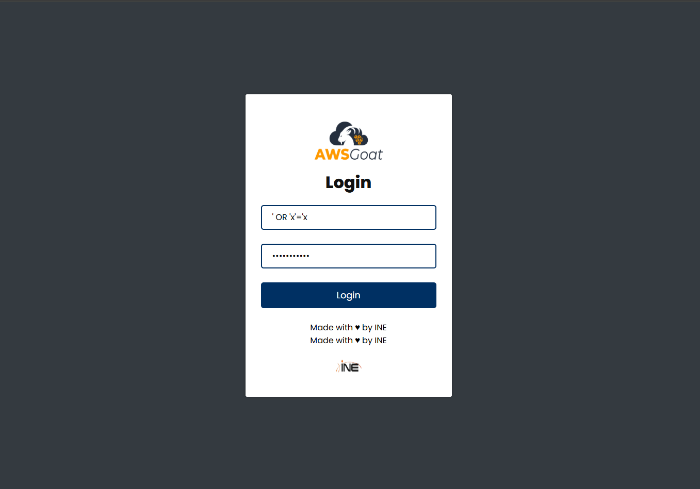
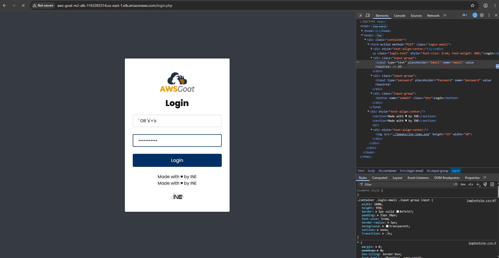
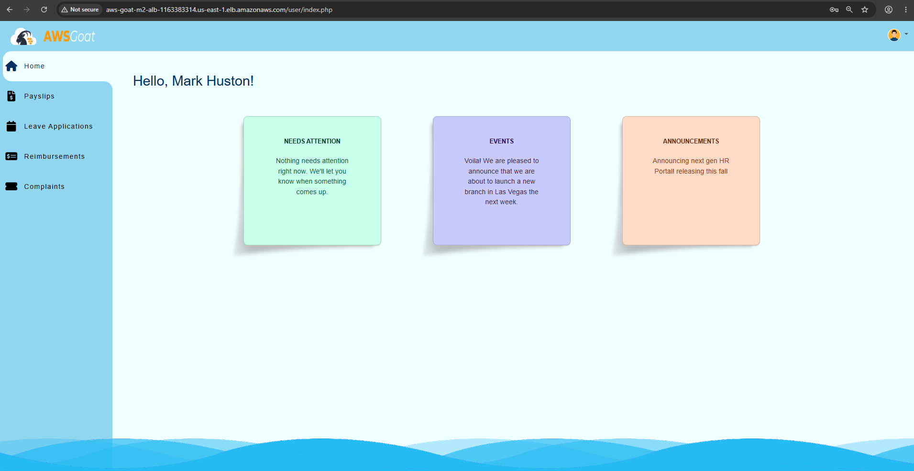
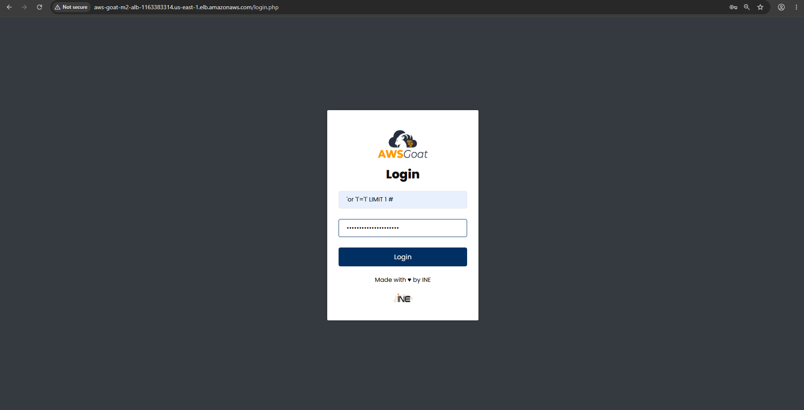
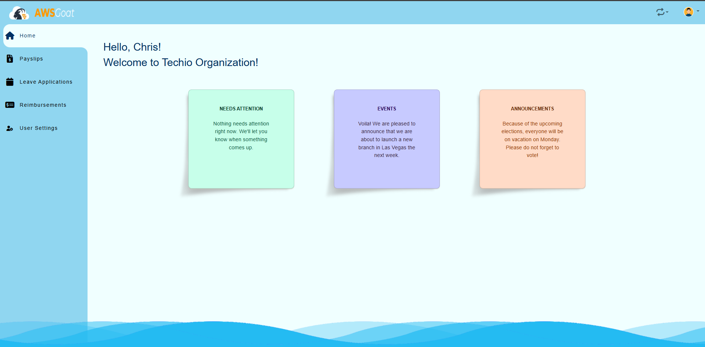
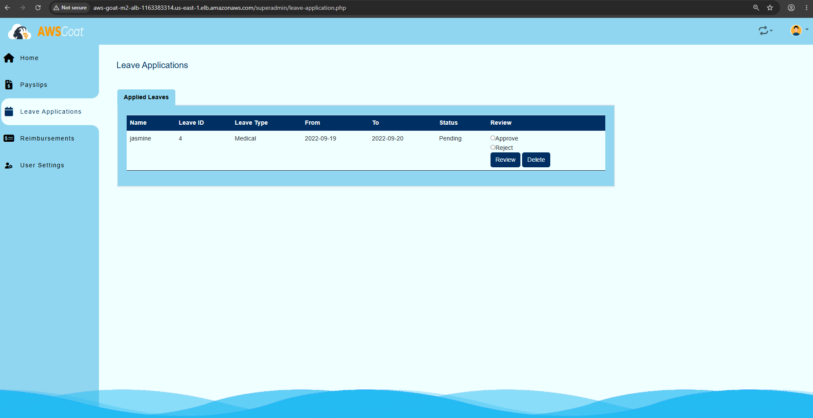

# Reto 1: Authentication Bypass (SQL Injection en login)

Intentar iniciar sesion con un injection, pero nos envia error

Cambiamos el campo de type=email por type=text. Esto para que podemas entrar al dashboard

Entrar a la pagina como un usuario ya exixtente

Entrar cambiando el usuario , agregando LIMIT 1# para Sobre el formulario de inicio de sesión de AWSGoat, probamos una inyección SQL en el campo de usuario utilizando el payload ' or '1'='1' LIMIT 1 #, con el objetivo de alterar la consulta que valida las credenciales y forzar que la condición siempre se evalúe como verdadera.

Entramos como el usuario admin, es el equivalente a limit = 1

Luego vamos a leave applications

Esto confirma que, tras el bypass de autenticación por SQL Injection en el login (' or '1'='1'# ), efectivamente se obtuvo acceso a la sección de superadministrador, desde donde es posible ver, aprobar, rechazar o eliminar solicitudes de permisos de cualquier empleado sin tener privilegios legítimos de admin.

| Campo | Detalle |
|---|---|
| Vulnerabilidad | SQL Injection (Authentication Bypass) |
| Clasificación OWASP | A03:2021  Injection |
| Ubicación | Formulario de login (campo Email), aplicación PHP del Módulo 2 |
| Payload usado | ' or '1'='1'# en el campo Email (previamente modificando el atributo type="email" a type="text" mediante el inspector, para evadir la validación del navegador) |
| Impacto | Bypass total de autenticación sin necesidad de credenciales válidas; acceso no autorizado directo a una cuenta con privilegios de superadministrador |
| Evidencia | Captura del payload en el campo Email y de la sesión iniciada en la vista /superadmin/reimbursment.php |
