# Reto 2: File Upload y Reverse Shell

Descarga de script reverse shell

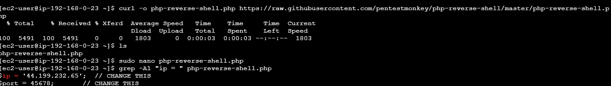

Una vez editado el archivo y cambiar la ip y el puerto con nuestra informacion de la instancia, verificamos que todo esta bien y la pondremos en escucha

Comandos usados:

curl -o php-reverse-shell.php https://raw.githubusercontent.com/pentestmonkey/php-reverse-shell/master/php-reverse-shell.php

nano php-reverse-shell.php

grep -A1 "ip = " php-reverse-shell.php

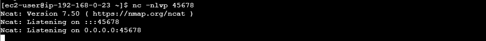

Dejaremos la vm en escucha

No compatibilidad con archivo reverse

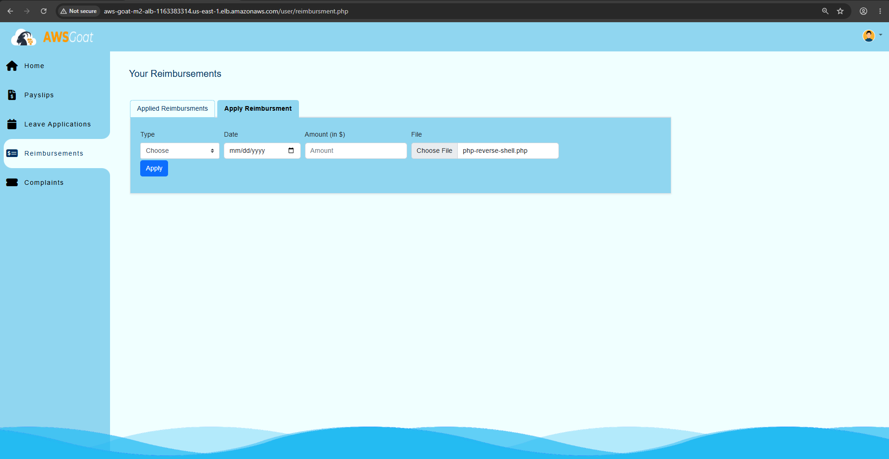

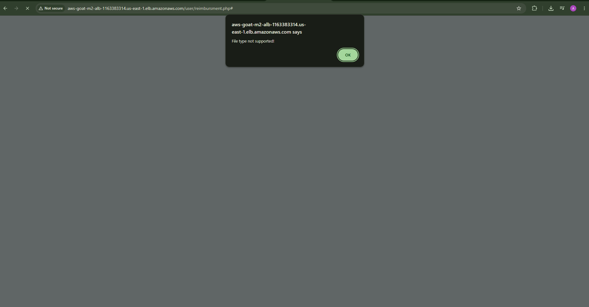

Aqui queda confirmado que un usuario normal no puede subir un archivo, ahora vamos a intentar con un usuario administrador

Desde un admin, entramos a payslips y cargamos el archivo a nombre de otra persona

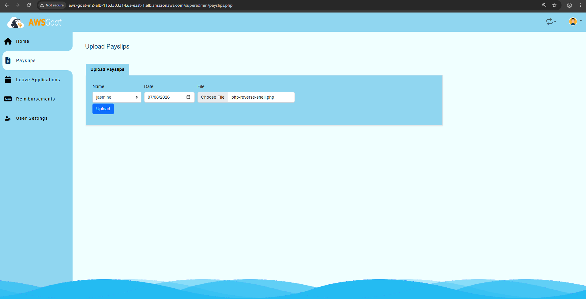

Ahora debemos regresar al usuario del cual cargamos el archivo para poder ver el nuevo payslip

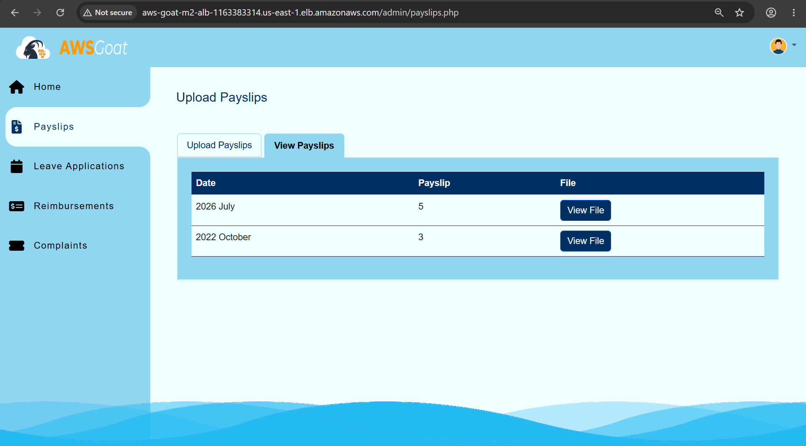

Efectivamente salio uno nuevo le damos en view file y deberia salir en la instancia que dejamos escuchando algo asi

Conexión del puerto en escucha

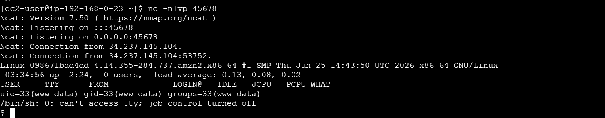

Una vez establecida la conexión, se obtuvo acceso a una shell interactiva dentro del contenedor de la aplicación, identificando el sistema operativo Linux subyacente y el estado de carga del servidor mediante el comando uptime.

Comando usado:

Nc –nlvp 45678

Reconocimiento post explotacion

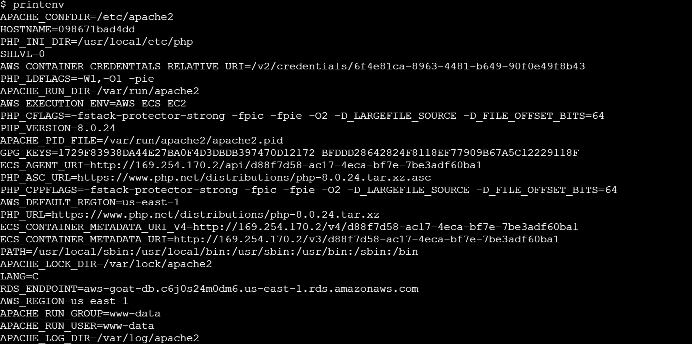

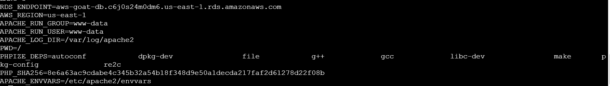

Ejecutamos el comando printenv con el objetivo de enumerar las variables de entorno del contenedor, técnica común en la fase de post-explotación para identificar información sensible expuesta a nivel de configuración.

Como resultado, se identificó la variable AWS_CONTAINER_CREDENTIALS_RELATIVE_URI, la cual expone la ruta relativa del endpoint de metadatos utilizado por tareas de ECS para obtener credenciales temporales del rol IAM asignado al contenedor. Esta variable es la pieza clave que permite realizar una solicitud posterior al servicio de metadatos y así extraer credenciales activas (Access Key, Secret Key y Session Token) sin necesidad de comprometer directamente el rol IAM.

Credenciales del rol IAM

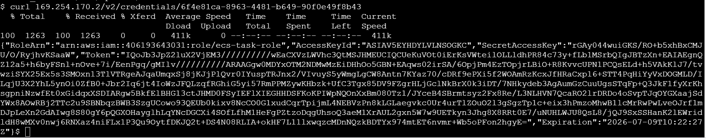

Tras la ejecución del comando vemos como muestra en detalle la respuesta completa obtenida al consultar el endpoint de metadatos del contenedor, confirmando la exposición de las credenciales temporales del rol IAM ecs-task-role: AccessKeyId, SecretAccessKey y Token de sesión, junto con su fecha de expiración (Expiration). Estas credenciales fueron las utilizadas posteriormente para autenticarse ante los servicios de AWS y proceder con la enumeración y extracción de secretos desde Secrets Manager.

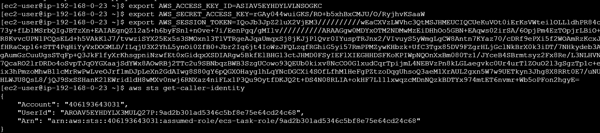

exportamos como variables de entorno las credenciales temporales extraídas previamente del rol IAM del contenedor: AWS_ACCESS_KEY_ID, AWS_SECRET_ACCESS_KEY y AWS_SESSION_TOKEN.

Posteriormente, se ejecutó el comando aws sts get-caller-identity con el fin de confirmar que las credenciales configuradas eran válidas y correspondían efectivamente al rol comprometido. La respuesta obtenida confirma la identidad asumida, mostrando el número de cuenta (Account), el identificador de usuario (UserId) y el ARN correspondiente al rol ecs-task-role, evidenciando así que el atacante logró suplantar exitosamente la identidad de dicho rol dentro del entorno de AWS.

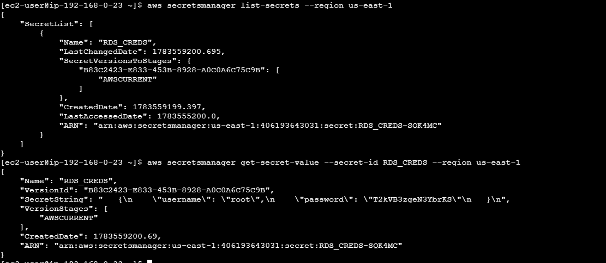

Utilizando las credenciales robadas del rol IAM del contenedor, se ejecutó el comando aws secretsmanager list-secrets con el fin de enumerar los secretos almacenados en el servicio Secrets Manager de la cuenta comprometida. Como resultado, se identificó un secreto denominado RDS_CREDS, cuyo nombre sugiere que contiene credenciales de acceso a una base de datos RDS.

Por otra parte, el comando aws secretsmanager get-secret-value --secret-id RDS_CREDS se hizo con el fin de obtener el contenido de dicho secreto. La respuesta confirmó que el rol IAM comprometido contaba con permisos suficientes para leer secretos sensibles, obteniendo así las credenciales reales de la base de datos: usuario root y su respectiva contraseña.

| Campo | Detalle |
|---|---|
| Vulnerabilidad | Unrestricted File Upload combinado con exposición de credenciales vía metadata de tarea ECS |
| Clasificación OWASP | A04:2021  Insecure Design (control de acceso a la subida de archivos deficiente)  A02:2021 Cryptographic Failures (exposición de credenciales en variables de entorno) |
| Ubicación | Funcionalidad de subida de payslips de la aplicación (endpoint de carga de archivos), accesible únicamente con rol administrador; variable de entorno AWS_CONTAINER_CREDENTIALS_RELATIVE_URI dentro del contenedor |
| Payload usado | Script php-reverse-shell.php (modificado con IP y puerto propios) subido en nombre de otro usuario desde una cuenta con privilegios de administrador; comando nc -nlvp 45678 para recibir la conexión; printenv para enumerar variables de entorno del contenedor |
| Impacto | Ejecución remota de código dentro del contenedor de la aplicación al lograr que el archivo malicioso fuera accedido por la víctima (view file); obtención de shell interactiva como www-data; exposición de la ruta de metadata de tarea ECS, permitiendo extraer credenciales temporales activas (AccessKeyId, SecretAccessKey, SessionToken) |
| Evidencia | Captura de la descarga y edición del script reverse shell; captura del error de subida como usuario normal vs. éxito como administrador; captura de la conexión recibida en el listener (nc); captura de printenv mostrando AWS_CONTAINER_CREDENTIALS_RELATIVE_URI |
