# Reto 3: ECS Container Breakout

Una vez dentro del contenedor comprometido como el usuario www-data, iniciamos una fase de reconocimiento para identificar una vía de escalamiento de privilegios y de acceso al servicio de metadatos de instancia (IMDS).

Intentamos acceder directamente al endpoint de metadatos con el comando curl -m 5 http://[IP_REDACTED]/latest/meta-data/, pero la conexión agotó el tiempo de espera, confirmando que el acceso directo al IMDS estaba bloqueado desde este contexto y que sería necesario buscar una ruta alterna.

Con el comando capsh --print revisamos las capabilities de Linux asignadas al proceso, identificando la presencia de cap_sys_ptrace dentro del bounding set, una capability que más adelante permitiría inyectar código en otro proceso con acceso a la red del host.

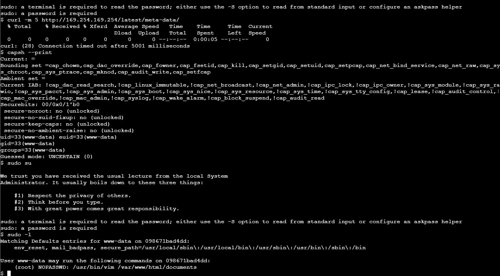

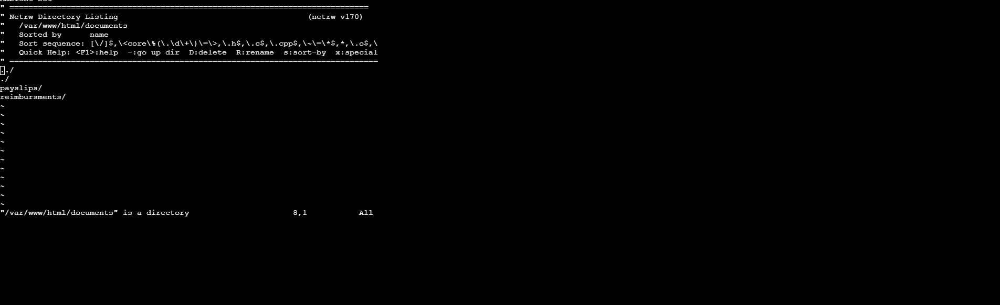

Continuando desde el permiso NOPASSWD encontrado con sudo -l, aquí se ejecutó sudo vim /var/www/html/documents como root. Como el argumento es un directorio y no un archivo, vim abre automáticamente su explorador de archivos integrado, netrw, mostrando el listado de /var/www/html/documents:Aprovechando el permiso NOPASSWD identificado en el paso anterior, ejecutamos sudo vim /var/www/html/documents. Al tratarse de un directorio y no de un archivo, vim abrió automáticamente su explorador de archivos integrado (netrw), mostrando el contenido del directorio del servidor web, incluidas las carpetas payslips y reimbursments.

Este comportamiento confirmó que vim se ejecutó efectivamente con privilegios de root, validando el vector de escalamiento de privilegios y dejando disponible el entorno de netrw como punto de partida para invocar una shell del sistema con esos mismos privilegios.

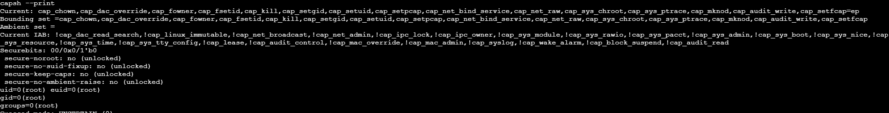

Tras obtener acceso a una shell desde netrw, verificamos el nivel de privilegios alcanzado ejecutando nuevamente capsh --print. La salida confirmó uid=0(root), euid=0(root) y groups=0(root), validando que efectivamente logramos escalar privilegios de www-data a root dentro del contenedor.

Adicionalmente, se confirmó que la capability cap_sys_ptrace seguía presente en el bounding set del proceso, la cual sería aprovechada en el siguiente paso para inyectar código en un proceso con acceso a la red del host y así alcanzar el servicio de metadatos de instancia.

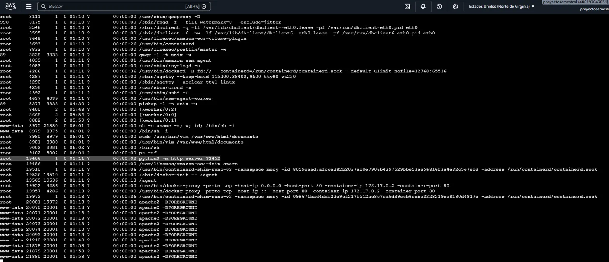

Con la shell root ya obtenida, ejecutamos un listado completo de procesos del sistema para identificar un objetivo adecuado para la inyección de código vía la capability cap_sys_ptrace. En el listado confirmamos nuestra propia cadena de procesos (sudo vim seguido de /bin/sh como root), y localizamos el proceso python3 -m http.server 31452 (PID 19406), ejecutándose como root y con acceso a la red del contenedor.

Este proceso fue seleccionado como objetivo para la siguiente fase del ataque, ya que al inyectarle shellcode aprovechando cap_sys_ptrace sería posible realizar peticiones de red con sus mismos privilegios y alcanzar el servicio de metadatos de instancia.

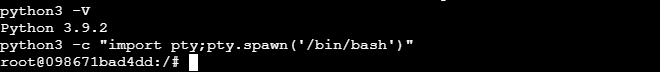

Dado que la shell obtenida a través de vim carecía de una terminal interactiva completa, utilizamos Python para generar una pseudo-terminal funcional. Con el comando python3 -c "import pty;pty.spawn('/bin/bash')" obtuvimos una shell bash interactiva como root, identificada por el prompt root@098671bad4dd:/#, lo que facilitó la ejecución de los siguientes comandos de reconocimiento y explotación.

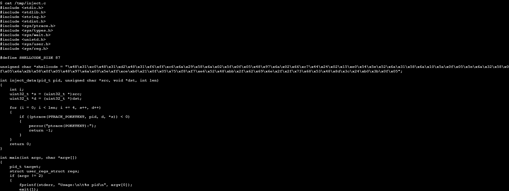

Preparamos un programa en C (inject.c) que aprovecha la capability cap_sys_ptrace para inyectar shellcode directamente en la memoria de otro proceso en ejecución. El programa define el shellcode a inyectar y una función inject_data que utiliza la syscall ptrace con la operación PTRACE_POKETEXT para escribir dicho shellcode, en bloques de 4 bytes, en la dirección de memoria del proceso objetivo, identificado por su PID.

Este inyector fue diseñado para dirigirse específicamente al proceso python3 -m http.server 31452 identificado previamente, con el fin de hacer que ejecute el shellcode con los mismos privilegios y acceso de red que dicho proceso.

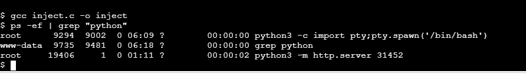

Compilamos el inyector con gcc inject.c -o inject, generando el binario ejecutable sin errores. Antes de ejecutar el ataque, confirmamos nuevamente el PID del proceso objetivo mediante ps -ef | grep "python", verificando que el servidor python3 -m http.server 31452 correspondía al PID 19406 y seguía corriendo como root.

Con el PID confirmado, procedimos a ejecutar el inyector apuntando específicamente a ese proceso.

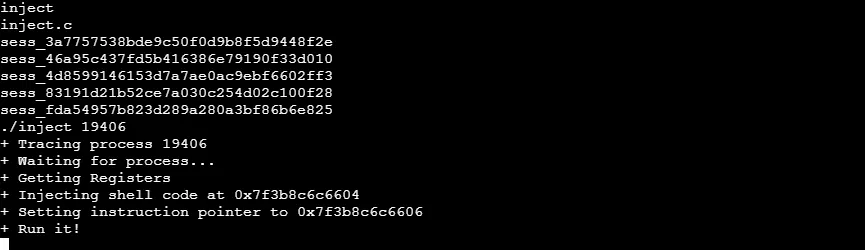

Ejecutamos el inyector contra el proceso objetivo con ./inject 19406. La salida confirmó cada fase del ataque: el programa se adjuntó al proceso mediante ptrace, obtuvo sus registros, escribió el shellcode en la dirección de memoria 0x7f3b8c6c6604, modificó el instruction pointer del proceso hacia esa misma dirección y finalmente reanudó su ejecución, forzando al proceso python3 -m http.server 31452 (que corría como root) a ejecutar el código inyectado en lugar de continuar con su comportamiento original.

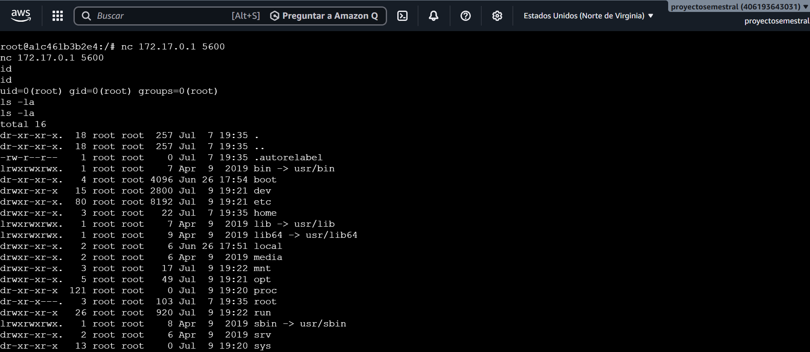

Tras la ejecución del inyector, el shellcode disparó una conexión reversa hacia nuestro listener en [IP_REDACTED]:5600. Al recibir la conexión, confirmamos privilegios de root con el comando id (uid=0, gid=0, groups=0) y, al listar el sistema de archivos raíz con ls -la, observamos una estructura completa de directorios (bin, boot, dev, home, proc, root, run, sys, entre otros), evidenciando que la ejecución del shellcode nos entregó acceso más allá del contenedor original, alcanzando el nivel de la instancia EC2 subyacente.

Este resultado confirmó el escape del contenedor (container breakout) mediante la explotación de la capability cap_sys_ptrace, habilitando el acceso directo al host y, por consiguiente, al servicio de metadatos de instancia (IMDS) desde ese contexto.

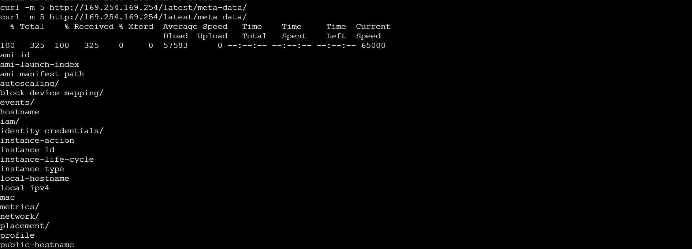

Desde el nuevo acceso obtenido tras el escape del contenedor, repetimos la consulta al servicio de metadatos de instancia con curl -m 5 http://[IP_REDACTED]/latest/meta-data/. A diferencia del intento inicial, que había fallado por timeout, esta vez la petición se completó exitosamente, devolviendo el listado completo de categorías disponibles del IMDS.

Entre los resultados identificamos la ruta iam/, correspondiente a las credenciales de seguridad del rol IAM asociado a la instancia EC2, la cual exploramos a continuación para extraer las credenciales temporales activas.

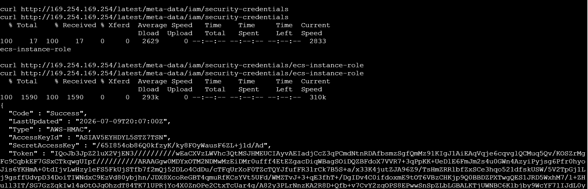

Finalmente, consultamos el endpoint iam/security-credentials del servicio de metadatos, el cual reveló el nombre del rol IAM asociado a la instancia: ecs-instance-role. Al consultar la ruta específica de ese rol (iam/security-credentials/ecs-instance-role), obtuvimos la respuesta completa con sus credenciales temporales activas: Access Key ID, Secret Access Key y Session Token.

Con esto completamos la cadena de ataque del Reto 3 – Módulo 2: partiendo de un usuario con privilegios limitados dentro del contenedor, escalamos privilegios mediante un permiso mal configurado de sudo sobre vim, aprovechamos la capability cap_sys_ptrace para inyectar código en un proceso con acceso a la red del host, escapamos del contenedor hacia la instancia EC2 subyacente y finalmente extrajimos credenciales activas del rol IAM de la instancia a través del servicio de metadatos, sin necesidad de comprometer directamente ningún usuario de AWS.

| Campo | Detalle |
|---|---|
| Vulnerabilidad | Privilege Escalation (sudo mal configurado) + Container Breakout (abuso de capability SYS_PTRACE) |
| Clasificación OWASP | A05:2021  Security Misconfiguration (permiso NOPASSWD sobre vim; capability innecesaria cap_sys_ptrace otorgada al contenedor) |
| Ubicación | Usuario www-data dentro del contenedor comprometido; permiso sudo /usr/bin/vim /var/www/html/documents sin contraseña; proceso python3 -m http.server 31452 (PID 19406) corriendo como root en el host |
| Payload usado | sudo vim /var/www/html/documents seguido de invocación de shell vía netrw/comando interno de vim; python3 -c "import pty;pty.spawn('/bin/bash')" para obtener tty interactiva; programa inject.c compilado con gcc, que usa ptrace(PTRACE_ATTACH/POKETEXT/SETREGS/DETACH) para inyectar shellcode de bind/reverse shell en el proceso objetivo; ./inject 19406 |
| Impacto | Escalada de privilegios de www-data a root dentro del contenedor mediante el permiso sudo mal configurado sobre vim; posteriormente, abuso de la capability cap_sys_ptrace (innecesaria para el contenedor) para inyectar código en un proceso del host con acceso a red, logrando un escape completo del contenedor hacia la instancia EC2 subyacente; una vez en el host, acceso exitoso al servicio de metadatos de instancia (IMDS)  inaccesible desde el contenedor original y extracción de las credenciales temporales activas del rol ecs-instance-role (Access Key ID, Secret Access Key, Session Token) |
| Evidencia | Captura de capsh --print mostrando cap_sys_ptrace en el bounding set; captura del acceso a netrw vía sudo vim; captura de id/capsh --print confirmando uid=0(root); captura de ps -ef identificando el proceso objetivo (PID 19406); captura de la compilación y ejecución de inject.c; captura de la conexión reversa confirmando uid=0 |
