# Reto 4: IAM Privilege Escalation

Enumeración de políticas IAM adjuntas al rol de la instancia

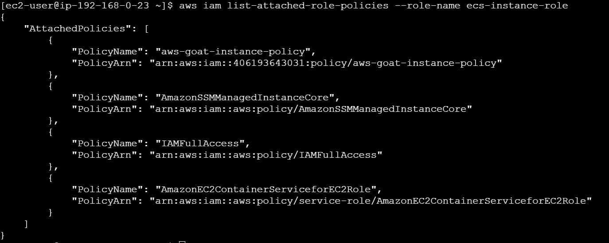

Desde la instancia EC2, ejecutamos aws iam list-attached-role-policies --role-name ecs-instance-role para enumerar los permisos del rol asociado. El resultado muestra cuatro políticas adjuntas, entre ellas IAMFullAccess, un privilegio excesivo que no es necesario para el funcionamiento normal de la instancia

Intento de creación directa de usuario IAM

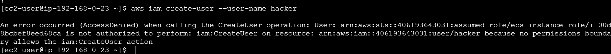

Con las credenciales del rol ecs-instance-role (que tiene IAMFullAccess), se intenta crear un usuario nuevo directamente con aws iam create-user --user-name hacker. La operación falla con AccessDenied: aunque el rol tiene el permiso iam:CreateUser a nivel de política, existe un permissions boundary adjunto al rol que no lo permite explícitamente, bloqueando la acción.

Identificación del permissions boundary aplicado al rol

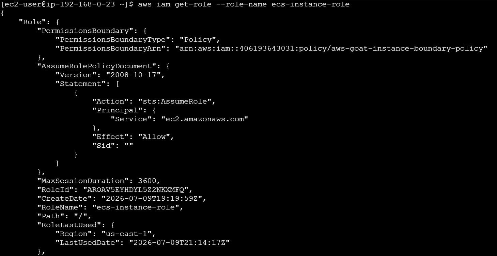

Consultamos el detalle del rol para confirmar qué política actúa como permissions boundary. La respuesta muestra que el rol tiene asociada la política "aws-goat-instance-boundary-policy", además de la política de confianza que permite a instancias EC2 asumir este rol. Este hallazgo es clave porque el boundary es el que realmente limita qué acciones de IAM se pueden ejecutar, más allá de lo que digan las políticas adjuntas al rol.

Metadata de la política de permissions boundary

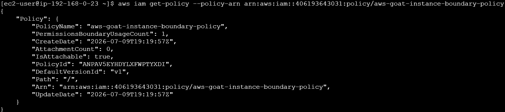

Este paso solo confirma la existencia y versión de la política; todavía falta ver el contenido real del documento de la política (el JSON con las acciones permitidas) para identificar qué privilegios habilita realmente y cómo aprovecharlos para escalar.

Contenido del documento de la política de boundary

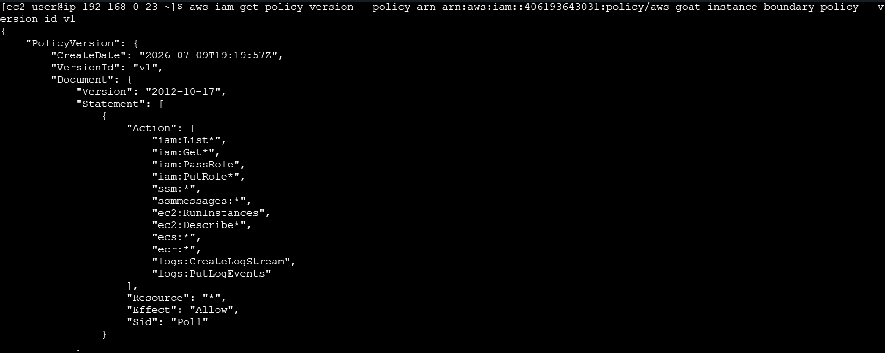

Obtenemos el documento completo de la versión activa de la política boundary. Ahí se revela la lista de acciones permitidas: entre ellas destacan iam:PassRole, iam:PutRole*, ec2:RunInstances y ssm:*. Esta combinación es la clave de la escalada: permite lanzar una instancia EC2 nueva pasándole un rol distinto.

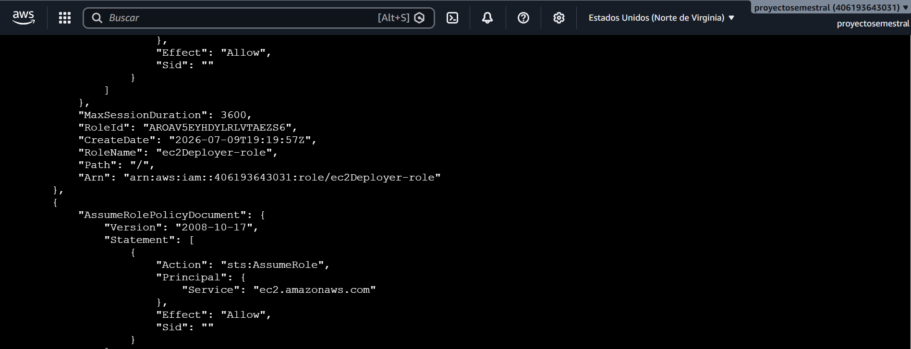

Esto fue todo el contenido que encontramos.

Enumeración de políticas del rol de despliegue

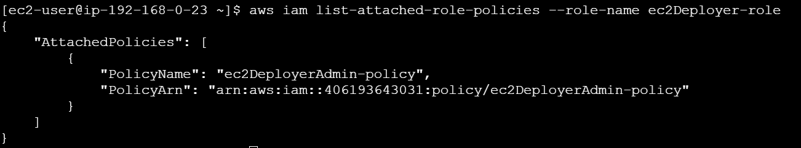

Aprovechando que el boundary permite pasar roles y describir información de IAM, se identifica un segundo rol en la cuenta, distinto al de la instancia actual, y se enumeran sus políticas adjuntas. Se encuentra una sola política asociada, cuyo nombre sugiere permisos administrativos amplios.

Confirmación de permisos administrativos totales en el rol de despliegue

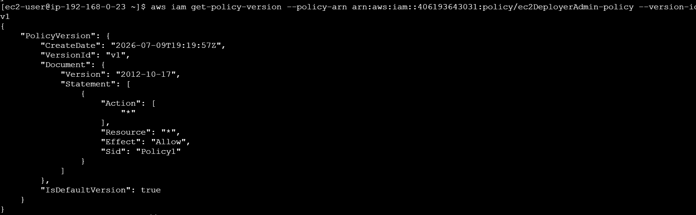

Conseguimos  el contenido de la política adjunta al rol de despliegue y se confirma que otorga acceso total: todas las acciones permitidas sobre todos los recursos, sin restricciones. Con esta confirmación queda claro el objetivo de la escalada: si se logra que una instancia asuma este rol, cualquier proceso corriendo ahí tendrá privilegios equivalentes a un administrador completo de la cuenta

Identificación del instance profile asociado al rol de despliegue

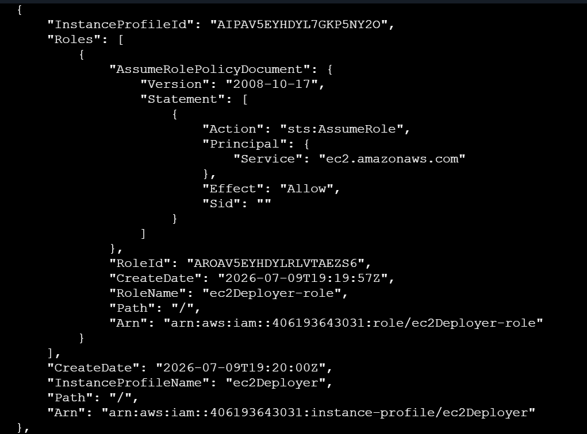

Enumeramos los instance profiles disponibles en la cuenta para encontrar cuál permite asociar el rol de despliegue a una instancia EC2 nueva. Se confirma que existe un instance profile específico ligado a ese rol, y que su política de confianza permite ser asumido por instancias EC2.

Búsqueda de una AMI válida para lanzar la instancia

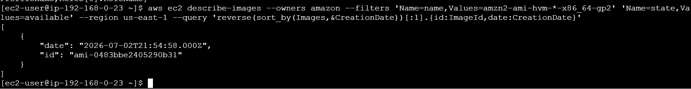

Vemos el catálogo de imágenes oficiales de Amazon para obtener el identificador de la AMI más reciente disponible en la región, filtrando por el tipo de arquitectura y estado.

Subredes disponibles

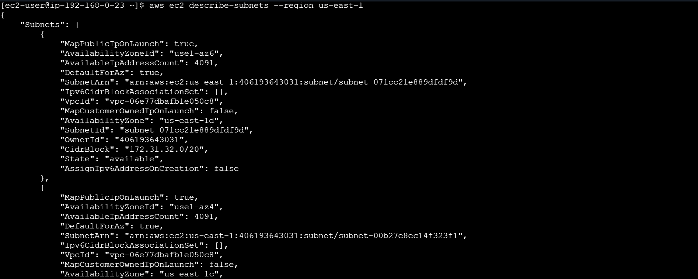

Se listan las subredes existentes en la región para identificar en cuál lanzar la instancia nueva, obteniendo datos como el identificador de subred, la VPC a la que pertenece y su bloque CIDR.

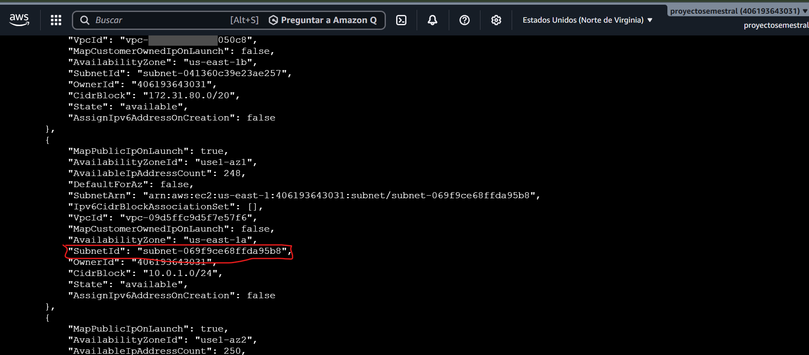

Entre todas las subredes disponibles, seleccionamos esa subred

Verificar grupos de seguridad disponibles

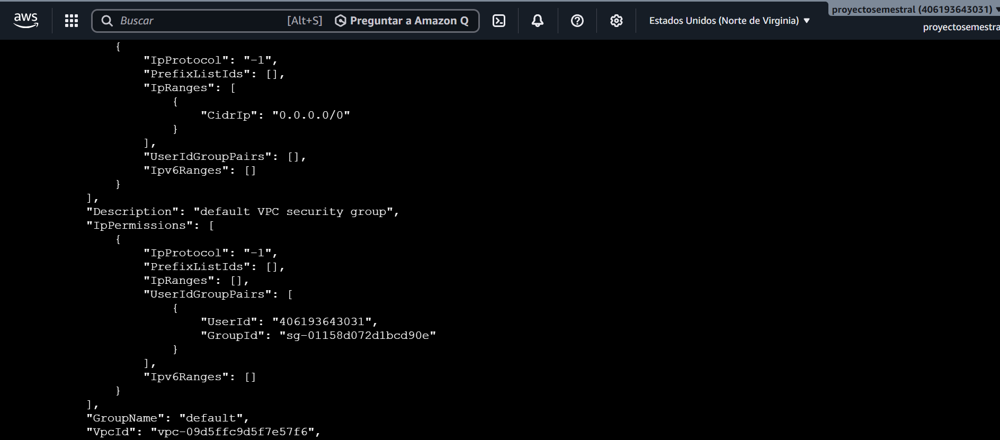

Revisamos los grupos de seguridad existentes en la VPC para identificar cuál usar al lanzar la instancia.

Crear instancia

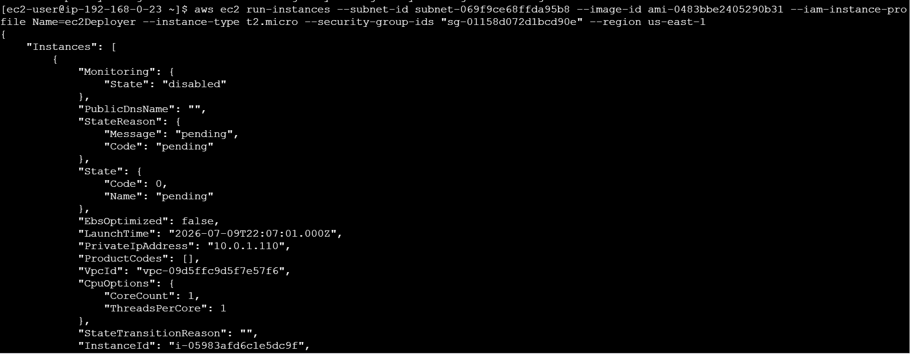

Con todos los parámetros reunidos (subred, AMI, tipo de instancia, grupo de seguridad y, sobre todo, el instance profile con el rol de despliegue de privilegios administrativos), se lanza una instancia EC2 nueva.
